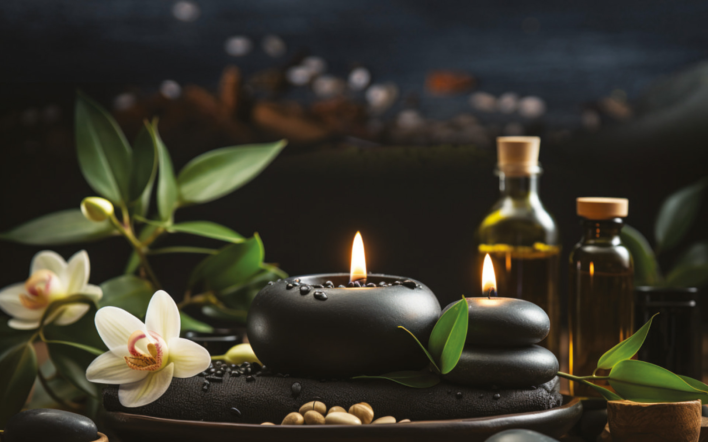

# Sahasrara Wellness Sanctuary

A premium, luxury wellness booking platform designed to provide a tranquil and seamless experience for clients seeking rejuvenation.



## 🌟 Key Features

- **Premium Landing Page**: An elegant, high-performance home page with smooth animations and deep-space aesthetic.
- **Multibranch Support**: Find and book appointments at your nearest sanctuary (Thodupuzha, Adimali, and more).
- **Therapist Finder**: Meet our master healers and choose your preferred expert.
- **Smart Booking System**: Real-time slot selection and secure appointment reservation.
- **Responsive Design**: Mobile-first luxury experience.
- **WhatsApp Integration**: Direct one-click enquiry channel.

## 🛠️ Tech Stack

- **Backend**: Django 5.1.6 (Python 3.13)
- **Database**: PostgreSQL
- **Frontend**: HTML5, Vanilla CSS, Bootstrap 5.3
- **Animations**: AOS (Animate On Scroll)
- **Icons**: Bootstrap Icons

## 🚀 Getting Started

### Prerequisites

- Python 3.13+
- PostgreSQL
- Git

### Installation

1. **Clone the repository**
   ```bash
   git clone https://github.com/jerin-jaison/Sahasrara-Wellness.git
   cd Sahasrara-Wellness
   ```

2. **Setup virtual environment**
   ```bash
   python -m venv venv
   source venv/bin/activate  # On Windows: venv\Scripts\activate
   ```

3. **Install dependencies**
   ```bash
   pip install -r requirements.txt
   ```

4. **Environment Variables**
   Create a `.env` file in the root directory and add your configurations (refer to `.env.example`).

5. **Run Migrations**
   ```bash
   python manage.py migrate
   ```

6. **Start the server**
   ```bash
   python manage.py runserver
   ```

## 📍 Our Locations

- **Thodupuzha**: Our flagship sanctuary in the heart of the city.
- **Adimali**: A peaceful retreat nestled in nature.

## 📞 Contact Us

- **Phone**: +91 97470 00210 / +91 97470 00543
- **Email**: bookings@sahasrarawellness.com
- **Instagram**: [@sahasrara.wellness](https://www.instagram.com/sahasrara.wellness)

---

&copy; 2026 Sahasrara Wellness. All rights reserved.
